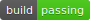

# ColorJump

[编译 - 通过]  :thumbsup:

简介：（这是一个跑酷游戏）

进度列表

- [ ] 美术风格设计 [周泊宁快干活！]
- [x] 启动图标 [暂时搁置]
- [x] 主菜单控制程序 [完成]
    - [x] 相机自动定位当前关卡 [完成]
    - [x] 以不同材质显示已完成，当前和未解锁关卡 [完成]
    - [x] 禁止玩家点击未解锁关卡 [完成]
- [ ] 主菜单地图设计 [进行中]

    - [x] 开始界面特效 [完成]
    - [ ] 地图贴图绘制 [某人已经在努力思考了，是不是啊]
- [ ] 游戏界面设计 [进行中]

    - [ ] 功能设计 [进行中]
        - [x] 记时 [完成]
        - [x] 玩家操控主角方块 [完成]
            - [x] 加速 [完成]
            - [x] 减速 [完成]
            - [x] 跳跃 [完成]
            - [x] 反重力 [完成]
        - [x] 下一关按钮 [完成]
        - [x] 重新开始按钮 [完成]
        - [x] 回到主菜单按钮 [完成]
        - [x] 死亡界面 [完成]
        - [x] 过关界面 [完成]
        - [ ] 玩家自定义按键绑定 [进行中]
            - [x] 设置界面 [完成]
            - [ ] 设置界面功能 [进行中]
    - [ ] 艺术设计 [未开始]
- [ ] 关卡设计 [进行中]
    - [ ] 增加路径两侧细节 [未开始]
    - [x] 关卡00搭建 [完成]
    - [x] 关卡01搭建 [完成]
    - [x] 关卡02搭建 [完成]
    - [x] 关卡03搭建 [完成]
    - [ ] 关卡04搭建 [未开始]
- [ ] 游戏内功能编程 [进行中]
    - [x] 加速时视野增广 [完成]
    - [x] 反重力视角变化 [完成]
    - [x] 反重力相机动画 [完成]
    - [ ] 惩罚方块（使视角混乱） [未开始]
    - [x] 死亡方块（杀死玩家） [进行中]
        - [x] 旋转 [完成]
        - [x] 大小变化 [完成]
        - [ ] 移动 [未开始]
    - [ ] 操作灵敏度调节 [未开始]
- [ ] 重生快捷键 [未开始]
- [ ] 建模 [未开始]

    - [ ] 角色方块皮肤 [未开始]
    - [ ] 场景装饰模型 [未开始]
- [ ] 关卡内背景贴图 [未开始]
- [ ] 中英双语支持 [等死你们]

## 更新日志

### [ 2019.5.18 | 21:31 ]

新增内容:

* 新增启动画面“图标”，假装有图标
* 中文字体支持

修复内容：

* 主目录界面相机会错误锁定关卡位置
* 显示设置界面时按esc会继续游戏
* 设置界面字体模糊

---

